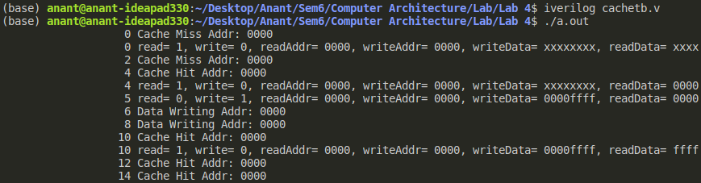

## Notes
- Cache is word Addressable
- Direct Mapped Data Cache Memory. 
- Cache contains 1024 Blocks
- each Block contains 16 words
- word size = 32 bits

## Input
- 32 bit addressable main memory

## Initializations
- 32 bit addressable main memory 2^32 elements should be there, but considering the scenario the main memory will be containing 1024 words.

## Output
 
