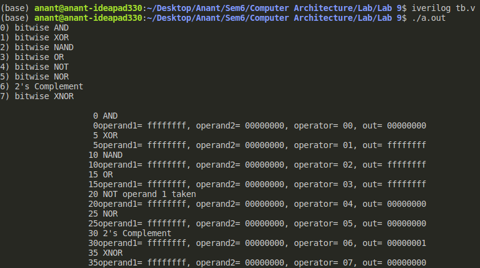

## Question Statement
Design 32-bit Logic unit.
Which can perform
1) bitwise AND
2) bitwise XOR
3) bitwise NAND
4) bitwise OR
5) bitwise NOT
6) bitwise NOR
7) 2's Complement
8) bitwise XNOR

Ouptut:

