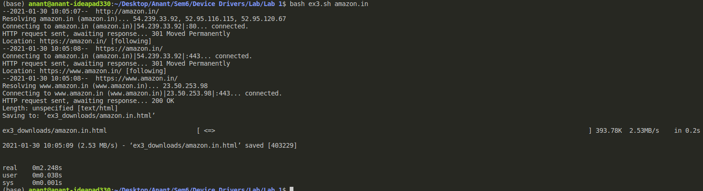
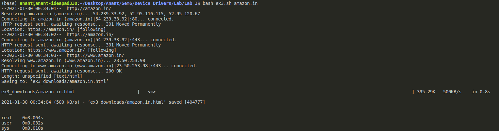

## Exercise 3 ##
Write a Shell program to download a webpage, given url. And analyse download performance by running at different time of the day. 

Reason: Same as above. All other lab exercises will be in C.

(Approximate time taken - 3 hours)  

### Code ###
```bash
#!/bin/bash
for url in $@
do
    time wget -O ex3_downloads/$url.html $url
done
```

### Output ###
At Night


In morning
