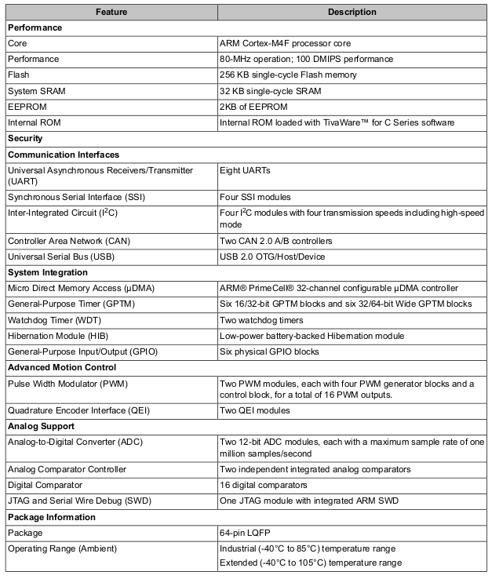

## Notes Embedded Systems

## MicroController Specs

## References
1. [Embedded Systems Shape Transformations](http://users.ece.utexas.edu/~valvano/Volume1/E-Book/)
2. [For Lab Microprocessor](https://www.ti.com/lit/ds/spms376e/spms376e.pdf?ts=1609669623553&ref_url=https%253A%252F%252Fwww.google.com%252F)
